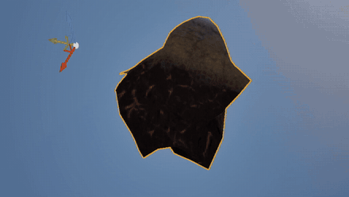

<h1 align="center">Procedural Climate Stone</h1>

  <em>A stone that generates procedurally from a seed, 
  using 3D fractal Perlin noise.</em>

  
  
  
  

  

  ▶ Full 53&nbsp;s capture: <a href="procedural-climate-stone.mp4"><b>procedural-climate-stone.mp4</b></a>

---

### What it is

One seed in, one stone out. The silhouette and surface come from **3D fractal Perlin noise**
— octaves layered over the mesh so every seed yields a different, believable rock.
Built in **Unreal Engine**, generated in **C++**.

### Climate

The stone takes **temperature** and **humidity** as arguments, passed in as **vertex colors**.
They drive how the surface weathers: warm and dry reads as bare, bleached rock; cool and wet
grows moss, damp patches and darker crevices.

| Channel | Argument | Range |
| :-----: | :------- | :---- |
| **R** | temperature | `0.0` cold → `1.0` hot |
| **G** | humidity | `0.0` dry → `1.0` wet |

Made with Unreal Engine and C++ &nbsp;·&nbsp; one-video presentation repository.

